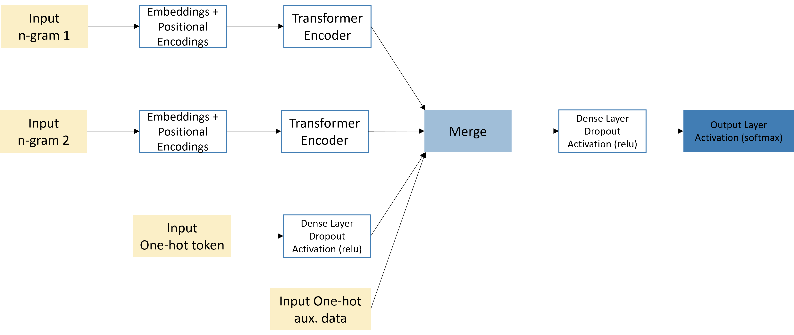

# WP10_Cluster2_TransformerClassification

This repository aims to show Austria's use of text classification of ISCO codes model, based on a transformer model trained from scratch.

The main file `ISCO_BuildModel.R` will sequentially call all other scripts and files stored in the `/R` and `/data` folders. It is a fully runable example by using example data loaded in the `R/load_data.R` script. In the script, some synthetic auxiliary variables are added, these are optional.

The model consists of four input streams:

1.  Auxiliary variables (one-hot encoded)

2.  Token IDs "one-hot encoded" (IDF values instead of 0/1)

3.  $N_1$-gram

4.  $N_2$-gram

    
