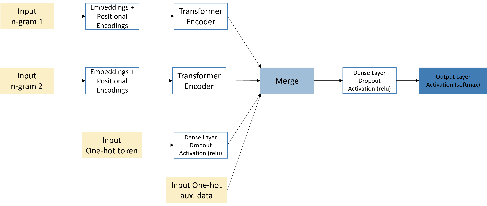

# WP10_Cluster2_TransformerClassification

<a href="https://datalab.sspcloud.fr/launcher/ide/rstudio?name=Dev_Transformer_Classification&version=2.4.5&s3=region-79669f20&init.personalInit=«https%3A%2F%2Fraw.githubusercontent.com%2FAIML4OS%2FWP10_Cluster2_TransformerClassification%2Frefs%2Fheads%2Fr_template%2FAIML4OS-template-quarto-r-main%2Finit.sh»&git.repository=«https%3A%2F%2Fgithub.com%2FAIML4OS%2FWP10_Cluster2_TransformerClassification»&git.branch=«r_template»&autoLaunch=true" target="_blank" rel="noopener" data-original-href="https://datalab.sspcloud.fr/launcher/ide/rstudio?name=Dev_Transformer_Classification&version=2.4.5&s3=region-79669f20&init.personalInit=«https%3A%2F%2Fraw.githubusercontent.com%2FAIML4OS%2FWP10_Cluster2_TransformerClassification%2Frefs%2Fheads%2Fr_template%2FAIML4OS-template-quarto-r-main%2Finit.sh»&git.repository=«https%3A%2F%2Fgithub.com%2FAIML4OS%2FWP10_Cluster2_TransformerClassification»&git.branch=«r_template»&autoLaunch=true"></a>

This repository aims to show Austria's use of text classification of ISCO codes model, based on a transformer model trained from scratch.
The runnable toy example can be accessed via this [link](https://datalab.sspcloud.fr/launcher/ide/rstudio?name=Dev_Transformer_Classification&version=2.4.5&s3=region-79669f20&init.personalInit=«https%3A%2F%2Fraw.githubusercontent.com%2FAIML4OS%2FWP10_Cluster2_TransformerClassification%2Frefs%2Fheads%2Fr_template%2FAIML4OS-template-quarto-r-main%2Finit.sh»&git.repository=«https%3A%2F%2Fgithub.com%2FAIML4OS%2FWP10_Cluster2_TransformerClassification»&git.branch=«r_template»&autoLaunch=true)

The main file `ISCO_BuildModel.R` will sequentially call all other scripts and files stored in the `/R` and `/data` folders. It is a fully runable example by using example data loaded in the `R/load_data.R` script. In the script, some synthetic auxiliary variables are added, these are optional.

The model consists of four input streams:

1.  Auxiliary variables (one-hot encoded)

2.  Token IDs "one-hot encoded" (IDF values instead of 0/1)

3.  $N_1$-gram

4.  $N_2$-gram

    
